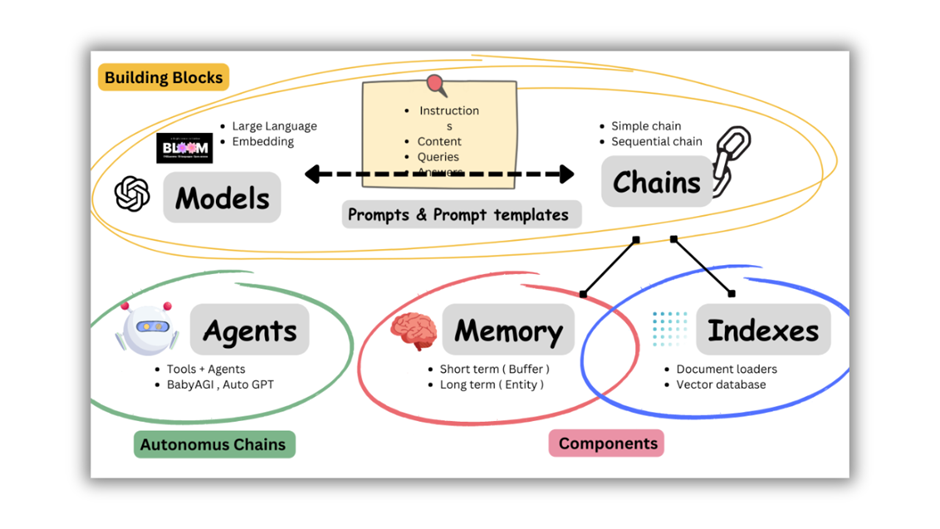

# Using LangChain with Ollama in Python

Reference - https://github.com/ollama/ollama/blob/main/docs/tutorials/langchainpy.md


---
## Why use LangChain?
- To build your application, you would need to write lengthy code using Huggingface library as we showed ?
- You need a lot of components - to write each component every time is laborious. 
- You need to stitch multiple components together - chain them together. 



---


Let's imagine we are studying the classics, such as **the Odyssey** by **Homer**. We might have a question about Neleus and his family. If you ask llama2 for that info, you may get something like:

> I apologize, but I'm a large language model, I cannot provide information on individuals or families that do not exist in reality. Neleus is not a real person or character, and therefore does not have a family or any other personal details. My apologies for any confusion. Is there anything else I can help you with?

This sounds like a typical censored response, but even llama2-uncensored gives a mediocre answer:

> Neleus was a legendary king of Pylos and the father of Nestor, one of the Argonauts. His mother was Clymene, a sea nymph, while his father was Neptune, the god of the sea.

So let's figure out how we can use **LangChain** with Ollama to ask our question to the actual document, the Odyssey by Homer, using Python.

Let's start by asking a simple question that we can get an answer to from the **Llama2** model using **Ollama**. First, we need to install the **LangChain** package:

`pip install langchain`

Then we can create a model and ask the question:

```python
from langchain.llms import Ollama
ollama = Ollama(base_url='http://localhost:11434',
model="llama2")
print(ollama("why is the sky blue"))
```

Notice that we are defining the model and the base URL for Ollama.

Now let's load a document to ask questions against. I'll load up the Odyssey by Homer, which you can find at Project Gutenberg. We will need **WebBaseLoader** which is part of **LangChain** and loads text from any webpage. On my machine, I also needed to install **bs4** to get that to work, so run `pip install bs4`.

```python
from langchain.document_loaders import WebBaseLoader
loader = WebBaseLoader("https://www.gutenberg.org/files/1727/1727-h/1727-h.htm")
data = loader.load()
```

This file is pretty big. Just the preface is 3000 tokens. Which means the full document won't fit into the context for the model. So we need to split it up into smaller pieces.

```python
from langchain.text_splitter import RecursiveCharacterTextSplitter

text_splitter=RecursiveCharacterTextSplitter(chunk_size=500, chunk_overlap=0)
all_splits = text_splitter.split_documents(data)
```

It's split up, but we have to find the relevant splits and then submit those to the model. We can do this by creating embeddings and storing them in a vector database. We can use Ollama directly to instantiate an embedding model. We will use ChromaDB in this example for a vector database. `pip install chromadb`

```python
from langchain.embeddings import OllamaEmbeddings
from langchain.vectorstores import Chroma
oembed = OllamaEmbeddings(base_url="http://localhost:11434", model="nomic-embed-text")
vectorstore = Chroma.from_documents(documents=all_splits, embedding=oembed)
```

Now let's ask a question from the document. **Who was Neleus, and who is in his family?** Neleus is a character in the Odyssey, and the answer can be found in our text.

```python
question="Who is Neleus and who is in Neleus' family?"
docs = vectorstore.similarity_search(question)
len(docs)
```

This will output the number of matches for chunks of data similar to the search.

The next thing is to send the question and the relevant parts of the docs to the model to see if we can get a good answer. But we are stitching two parts of the process together, and that is called a chain. This means we need to define a chain:

```python
from langchain.chains import RetrievalQA
qachain=RetrievalQA.from_chain_type(ollama, retriever=vectorstore.as_retriever())
qachain.invoke({"query": question})
```

The answer received from this chain was:

> Neleus is a character in Homer's "Odyssey" and is mentioned in the context of Penelope's suitors. Neleus is the father of Chloris, who is married to Neleus and bears him several children, including Nestor, Chromius, Periclymenus, and Pero. Amphinomus, the son of Nisus, is also mentioned as a suitor of Penelope and is known for his good natural disposition and agreeable conversation.

It's not a perfect answer, as it implies Neleus married his daughter when actually Chloris "was the youngest daughter to Amphion son of Iasus and king of Minyan Orchomenus, and was Queen in Pylos".

I updated the chunk_overlap for the text splitter to 20 and tried again and got a much better answer:

> Neleus is a character in Homer's epic poem "The Odyssey." He is the husband of Chloris, who is the youngest daughter of Amphion son of Iasus and king of Minyan Orchomenus. Neleus has several children with Chloris, including Nestor, Chromius, Periclymenus, and Pero.

And that is a much better answer.
